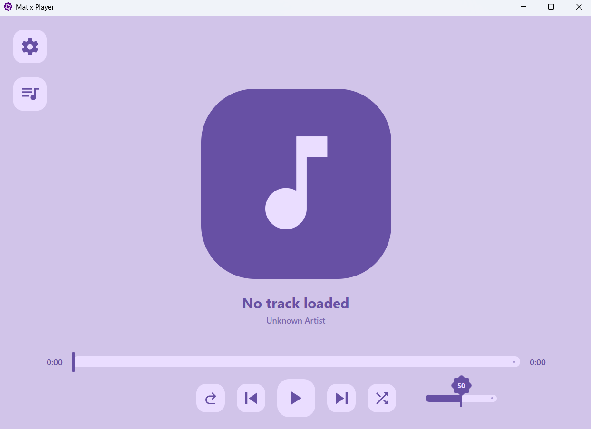
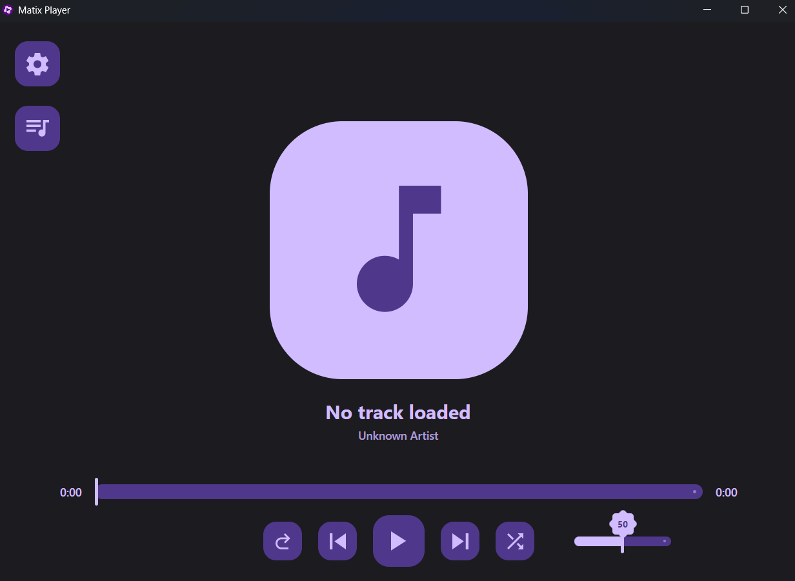

# Matix Music Player 🎵

**Matix** is a modern, lightweight, and cross-platform desktop audio player built with **C#** and **Avalonia UI**. Designed with **Material Design 3** principles, it offers a sleek and intuitive user experience for managing and listening to your local music library on both Windows and Linux.


[](https://dotnet.microsoft.com/en-us/download/dotnet/9.0)
[](https://avaloniaui.net/)

## ✨ Features

-   **Cross-Platform**: Seamless performance on Windows and Linux distributions.
-   **Material Design 3**: A beautiful, modern interface with support for dynamic themes and accent colors.
-   **High-Quality Audio**: Powered by the **LibVLCSharp** engine for stable and broad format support.
-   **Metadata Management**: Automatic reading of track titles, artists, and album art using **TagLib#**.
-   **Localization**: Full support for multiple languages (English, Ukrainian) with instant switching.
-   **Performance**: Asynchronous file loading and low system resource consumption.

## 🛠️ Technology Stack

-   **Framework**: [Avalonia UI](https://avaloniaui.net/) (MVVM Pattern)
-   **Runtime**: [.NET 9.0](https://dotnet.microsoft.com/en-us/download/dotnet/9.0)
-   **Audio Engine**: [LibVLCSharp](https://github.com/videolan/libvlcsharp)
-   **Tagging Library**: [TagLib#](https://github.com/mono/taglib-sharp)
-   **UI Styles**: [Material.Avalonia](https://github.com/AvaloniaCommunity/material.avalonia)

## 📸 Screenshots

| Light Mode | Dark Mode |
| :---: | :---: |
|  |  |

## 🚀 Getting Started

### Prerequisites
-   [.NET 9.0 SDK](https://dotnet.microsoft.com/en-us/download/dotnet/9.0)
-   **VLC Player** (For Linux users Debian/Ubuntu: `sudo apt install vlc`, Arch: `sudo pacman -S vlc`)

### Installation & Run
1.  **Clone the repository:**
    ```bash
    git clone https://github.com/gllsss69/Matix.git
    cd Matix
    ```
2.  **Restore dependencies:**
    ```bash
    dotnet restore
    ```
3.  **Run the application:**
    ```bash
    dotnet run --project Matix/Matix.csproj
    ```

## 📂 Project Structure

-   `Models/` — Data structures for tracks and playlists.
-   `ViewModels/` — Application logic and state management.
-   `Views/` — XAML-based UI definitions.
-   `Commands/` — Implementation of the Command pattern for UI interactions.
-   `Resources/` — Localization dictionaries and global styles.


## 🤝 Contributing

Contributions are welcome! Feel free to open an issue or submit a pull request if you have suggestions for new features or bug fixes.
